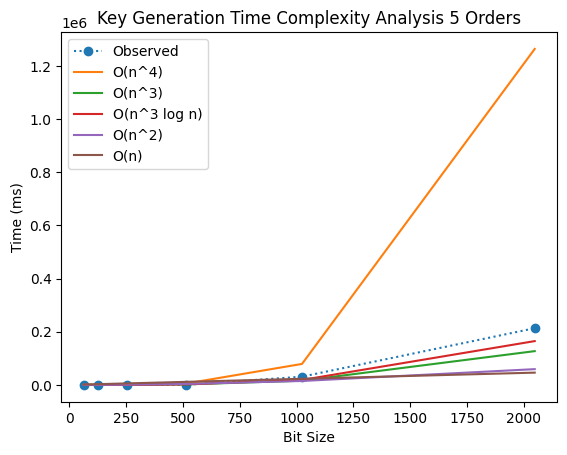
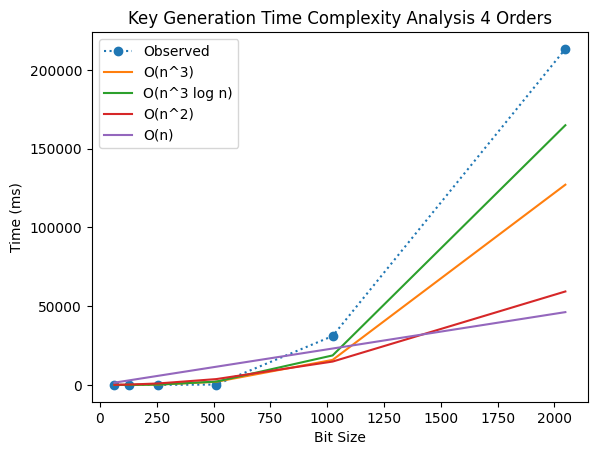
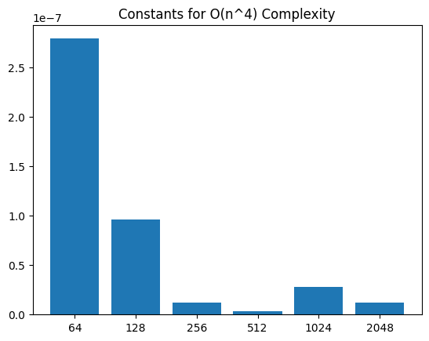
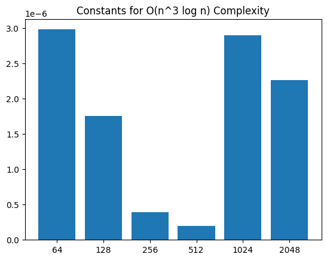
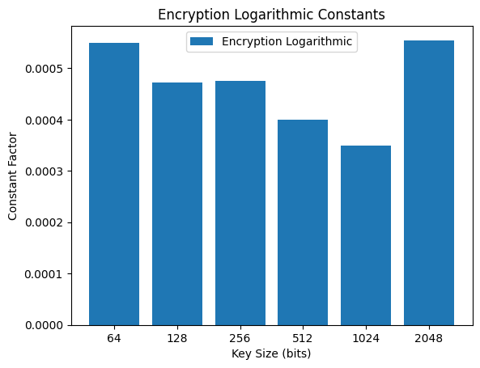
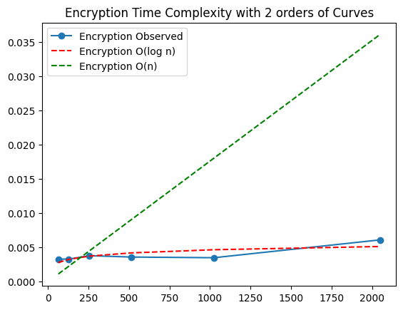
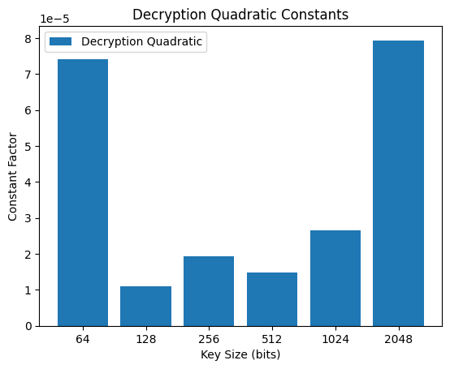
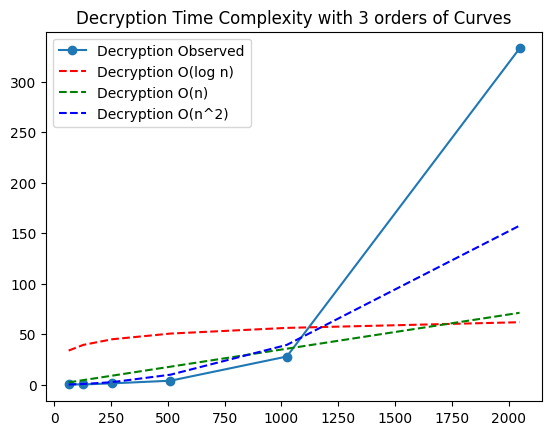

# Project Report - RSA and Primality Tests

## Baseline

### Design Experience

I met with Duncan Lewis to discuss my all my designs on 9/19/2025

Summary: For the mathematical functions of RSA, my design is to implement ModExp based on the psuedocode found in the textbook. With the fermat primality testing, I will use the Fermat's little theorem psuedocode but only try values of a up to some integer k. This will of course be implemented by calling modexp. For prime number generation, I will simply generate a ranodm number within the specific bit range using pythons built in random library. Then, I will test those random number on the primality test until I find one that is prime.

### Theoretical Analysis - Prime Number Generation

#### Time 

##### generate_large_prime - **O(n^4)**


```py
def generate_large_prime(n_bits: int) -> int:
    """Generate a random prime number with the specified bit length"""
    # https://xkcd.com/221/
    while True:
        prospect = random.getrandbits(n_bits)
        if fermat(prospect, 20):
            return prospect
```

First line there is generating the random number. For generating the prime numbers. Generating a random number n-bit number (first line) to test it is largely O(n) linear becaues I think you would need to choose a random 0 or 1 for each bit. You need to do this an arbitrary about of time, so I'll attach a constant O(k * n). 

```py
def fermat(N: int, k: int) -> bool:
    """
    Returns True if N is prime
    """
    assert N > 2
    for i in range(k):
        a = random.randint(2, N-1)
        result = mod_exp(a, N-1, N)
        if result != 1:
            return False
    return True
```

Then, we have the primality testing. Look at the second line, for me its 20 fermat tests per candidate. O(K * n * 20). Each invividual fermat test has one call to modexp (fourth line). 

```py
def mod_exp(x: int, y: int, N: int) -> int:
    if y == 0:
        return 1
    z = mod_exp(x, y // 2, N)
    y_is_even = y % 2 == 0
    if y_is_even:
        return (z * z) % N
    return (x * z * z) % N
```


In modexp, the call stack is approximately n calls deep because it bit-shifts y each time (line 4). Each call on the stack contains a bitshift (from the integer division), which I estimate is on average O(n) to shift n bits, and at least 1 call to n * n multiplication (line 6 and 7), which I estimate to be O(n^2). This makes modexp O((n^2 + n)n) or O(n^3 + n^2) or O(n^3). 

Putting everything together we get O(20kn^4 + 20kn^3). Constants are dropped and higher order polynomial dominates lower, so my final analysis is **O(n^4)**

#### Space

##### generate_large_prime - **O(n^2)**

```py
def generate_large_prime(n_bits: int) -> int:
    """Generate a random prime number with the specified bit length"""
    # https://xkcd.com/221/
    while True:
        prospect = random.getrandbits(n_bits)
        if fermat(prospect, 20):
            return prospect
```

For memory, the generate primes function will have at most n bits of data for a single candidate primes O(n) because each candidate prime gets garbage collected after it fails the test. Integers are passed by reference so the space won't be doubled from the function call to fermat (aside from the pointer space overhead of course).

```py
def fermat(N: int, k: int) -> bool:
    """
    Returns True if N is prime
    """
    assert N > 2
    for i in range(k):
        a = random.randint(2, N-1)
        result = mod_exp(a, N-1, N)
        if result != 1:
            return False
    return True
```

For each of k iterations of the fermat test for a given prime, the same is also true, all the space of that test for a given call will be garbage collected through the for loop. For that reason, we only need to consider how much memory is being used by a single n-bit integer for one a value of the fermat test.

In a given iteration in the for loop of the fermat test, you store the a value, which could be n bits, and an N - 1 value, so O(3n) so far. Remember that the passing by reference still applies here.

```py
def mod_exp(x: int, y: int, N: int) -> int:
    if y == 0:
        return 1
    z = mod_exp(x, y // 2, N)
    y_is_even = y % 2 == 0
    if y_is_even:
        return (z * z) % N
    return (x * z * z) % N
```

For modexp, the stack in n deep. Each call contains 3 integers that are n-bits large, but technically the y bit length decreases by one each time (line 3), which creates a triangular structure storing half the normal space that it would. So, effectively, y accounts for O(n * n/2) space. And x and n are both simply (n^2) because they dont change with each stack. For all three we get O(n^2 + n^2 / 2).

When we drop the contants there, we get **O(n^2)** space complexity.

### Empirical Data

| N    | time (ms) |
|------|-----------|
| 64   |1.7205     |
| 128  |   18.9050 |
| 256  | 28.8964   |
| 512  |   416.090 |
| 1024 |  3235.74  |
| 2048 |  77085.2  |

### Comparison of Theoretical and Empirical Results

- Theoretical order of growth: **O(n^4)**
- Measured constant of proportionality for theoretical order: 3.218171623153566e-08
- Empirical order of growth (if different from theoretical): **O(n^3)**
- Measured constant of proportionality for empirical order: 5.398020639938191e-06


As you can see in this plot of emperical data, O(n^4) is clearly not the correct growth order for generating prime numbers. Another plot of this would show that O(n^4) was completely out of bounds such that you couldn't even see the observed line!

Instead, it appears that the observed is somewhere in between O(n^2) and O(n^3), 

_contant_plot.png)

But because the constant distribution for O(n^3) is so much more evenly spread than O(n^2), its fair to say that O(n^3) best mirrors this order of growth. Also, from the graph it appears that the observed is leaving O(n^2) rapidly.

My observed O(n^3) differs from my theoretical (n^4) by literally an order of magnitude! One reason why that might be the case is performance optimizations in the processor that make doing a 64-bit bitshift actually an O(1) operation. This would make it so that division by 2 actually wouldn't be linear, it would be constant. There are potentially other explanations, but another reason why they might differ is because the arithmetic of division and multiplication may not have exactly been O(n^2) under the hood.

## Core

### Design Experience

I met with Duncan Lewis to discuss my all my designs on 9/19/2025

Summary: To implement the extended euclids algorithm, I will simply implant the psuedocode into real code. However, I will also make heavy use of my modexp function.

For public and private key generation I will to the following in order:
1. Generate the random prime numbers p and q with my random_prime function.
2. calculate N = p * q
3. calculate phi = (p-1)(q-1). (I've heard this be called Euler's Phi so I use that name)
4. calculate e by iterating through the list of primes and taking extended_euclid(phi, e). If if the GCD part of the return tuple returns a 1, then this e will be the true e, and d, which is the private key, will be set = b from the return tuple. Such that de = 1 (mod phi)
5. return N, e (public), and d (private)

### Theoretical Analysis - Key Pair Generation

#### Time

##### generate_key_pairs - **O(n^4)**

```py
def generate_key_pairs(n_bits) -> tuple[int, int, int]:
    """
    Generate RSA public and private key pairs.
    Randomly creates a p and q (two large n-bit primes)
    Computes N = p*q
    Computes e and d such that e*d = 1 mod (p-1)(q-1)
    Return N, e, and d
    """
    p = generate_large_prime(n_bits)
    q = generate_large_prime(n_bits)
    N = p * q
    phi = (p-1) * (q-1)
    e, d = gen_ed(phi)
    return N, e, d
```

As stated previously I have estimated prime number generation to be O(n^4). Calculating N and phi are together simply O(2n^2) assuming quadratic complexity for multiplication (line 4 and 5). Finding d and e means calling extended euclid at most 24 times (the lengths of the prime number generation.)

```py
def gen_ed(phi: int) -> tuple[int,int]:
    for pros_e in primes:
        x, y, z = extended_euclid(phi, pros_e)
        if z == 1:
            return pros_e, y % phi
    raise RuntimeError("Didnt have enough primes")
```

All that gen_ed does it call extended euclid as many times as it takes to find an e relatively prime to phi. Its addition to the complexity is simply an arbitary constant k that it takes to find it. Extended Euclid is the real thing to consider

```py
def extended_euclid(a: int, b: int) -> tuple[int, int, int]:
    assert a > b
    if b == 0:
        return 1, 0, a 
    x, y, z = extended_euclid(b, a % b)
    return y, x - ((a // b) * y), z
```

In extended euclid, our initial call has a= phi (potentially 2n-bit) and b = the prospective e (negligible bit). The next recursive call will see the next a = prospective e > b! because of line 4 a % b. This means that it has drastically reduced the size of phi to less than e! This also means that the size of the call stack isn't necessarily a function of n because even if n were so large, the next call would still be guarenteed to make it be less than the prospective e. We can then generalize the length of the call stack to be that of an arbitrary constant k (depending on which prospective e which got). Each call contains subtracting O(n), floor integer division O(n^2), and multiplication O(n^2) on line 5. This gives us O(2n^2 + n) per call and O(k(2n^2 + n)) = O(n^2) for euclids algorithm.

Putting these together O(n^4 + 2n^2 + 24(n^2)). Dropping the constants and using polynomial domination rules puts my final prediction at **O(n^4)** for key pair generation. I predict that prime number generation still remains the highest order time complexity in the processs.

#### Space

##### generate_key_pairs - **O(n^2)**

```py
def generate_key_pairs(n_bits) -> tuple[int, int, int]:
    """
    Generate RSA public and private key pairs.
    Randomly creates a p and q (two large n-bit primes)
    Computes N = p*q
    Computes e and d such that e*d = 1 mod (p-1)(q-1)
    Return N, e, and d
    """
    p = generate_large_prime(n_bits)
    q = generate_large_prime(n_bits)
    N = p * q
    phi = (p-1) * (q-1)
    e, d = gen_ed(phi)
    return N, e, d
```

My estimate for prime number generation space was O(n^2). N and Phi take up at most (becuase there both two n-bits multiplied together) 2n each so O(4n) for both. e itself is negligible in space, but finding requires calling extended euclid which is an aribtrary constant guarenteed. d is also about 2n at the max because its multiplied by y to get phi (remember that Ax + By = z). It's fair to say that the instance of this function is about (6n)

```py
def gen_ed(phi: int) -> tuple[int,int]:
    for pros_e in primes:
        x, y, z = extended_euclid(phi, pros_e)
        if z == 1:
            return pros_e, y % phi
    raise RuntimeError("Didnt have enough primes")
```

gen_ed has a phi (2n) passed by reference, x is a small number,  neglibible in size (Ax + By = z = 1), but y is about 2n becuase its comparable to the size of phi. This fucntion would then take about O(4n) space

```py
def extended_euclid(a: int, b: int) -> tuple[int, int, int]:
    assert a > b
    if b == 0:
        return 1, 0, a 
    x, y, z = extended_euclid(b, a % b)
    return y, x - ((a // b) * y), z
```

Remember from my time complexity that the call stack here is that of some arbitray constant (it doesnt scale with n). This means we can treat the initial call as the space complexity. The value a gives us 2n because its phi; b is negligible because its e. a % b is also negligible because its less than e.

The value x would be comparable to e because (Ax + By = c = 1). The value y would be comparable to phi for the same reason (2n). Remember that z = 1 (or likely close to it if e isnt relatively prime to phi), so its negligible. That leaves us with O(4n) for this part.

To calculate the total space complexity we take O(n^2 + 6n + 4n + 4n) = O(n^2). So, **O(n^2)** is my final prediction.

### Empirical Data

| N    | time (ms) |
|------|-----------|
| 64   |  4.6821   |
| 128  | 25.762    |
| 256  |   53.090  |
| 512  |  234.22   |
| 1024 |  31043    |
| 2048 |  213340   |

### Comparison of Theoretical and Empirical Results

- Theoretical order of growth: **O(n^4)**
- Measured constant of proportionality for theoretical order: 7.18626906755435e-08
- Empirical order of growth (if different from theoretical): **O(n^3 logn)**
- Measured constant of proportionality for empirical order: 1.7450203770498989e-06



As you can see here, my theoretical O(n^4) was clearly outpacing my observed data. It was leaving everything in the dust!



A closer look here shows that clearly O(n^3 logn) got the closest to my observed and was by far the closest representation.



The constant of proportionaity spread among all constants of O(n^4) were not uniform at all



The constant spread for O(n^3 log n) was much more uniform and was the best among all orders tested.

I think that my theoretical of O(n^4) was different so much from my observed O(n^3 logn) becuase I simply had gotten the prime number generation so wrong. Because the prime number generation turned out to be only O(n^3), it drastically changed my estimate for this.

In effect, I think that generating the keys were simply O(n^3) plus some additional overhead per prime, which happened to be logn. I'm unsure as to why to why this overhead actually made a different becuase in the theoretical for euclid, I calculated O(n^2) for that. In a perfect world, we would simply get O(n^3 + n^2) = O(n^3). 

And yet, there was still an extra logn of operations happening. I think that this could be due to noise in the data and also the fact that most of the time was taken up by the prime number generation. There could have been variability within the prime number generation too.

## Stretch 1

### Design Experience

I met with Duncan Lewis to discuss my all my designs on 9/19/2025

Summary: I will use the generate key pair function developed previously to generate the pair.

To encrypt a message, the simple formula of message^e mod N = y encrypted message. And to decrypt a message use y^d mod N.

To do my theoretical analysis. I will simply analyze each function and give my best theoretical calculation of the time complexity.

For the emperical analysis, I will track the time using python's time library. I will use matplotlib to display the data and see if I can predict the order of growth f(x). I may do this for several orders of growth. After that, I will calcualte the constant of proportionality by simply diving the emperical value / function value. I will sum these constants and average them to get a constant of proportionality just as is shown in the instructions.

### Theoretical Analysis - Encrypt and Decrypt

#### Time - 

##### encrypt - O(n^2)

```py
# Encrypt the message
ciphertext = mod_exp(message, e, N)
```

All this does is use modexp. As you can see in my time theoretical for modexp. I predicted that modexp was approximately O(n^3) when y and n are n-bits. 

```py
def mod_exp(x: int, y: int, N: int) -> int:
    if y == 0:
        return 1
    z = mod_exp(x, y // 2, N)
    y_is_even = y % 2 == 0
    if y_is_even:
        return (z * z) % N
    return (x * z * z) % N
```

However, when encrypting, e, negligible is size beucase it just goes up to 97, is the exponent used. This means that when encrypting, the call stack isn't necessary n deep becuase y in this case is not an n-bit integer. For that reason, for encryption, the call stack should actually be that of an arbitrary constant k (depending on e) deep.

However, because z can be up to n-bits (because you mod N on lines 6 and 7), the multiplication is still O(n^2), making encryption **O(n^2)**

##### decrypt - O(n^3)

```py
# Decrypt the message
decrypted_message = mod_exp(ciphertext, d, N)
```

There's only one differnce here. When decrypting, the private key, d, actually is n-bits (see my analysis on euclids for core), which means that in that case, the call stack would actually be n deep, making decryption **O(n^3)** because of the O(n^2) multiplication.

#### Space

##### encrypt O(n)
```py
def mod_exp(x: int, y: int, N: int) -> int:
    if y == 0:
        return 1
    z = mod_exp(x, y // 2, N)
    y_is_even = y % 2 == 0
    if y_is_even:
        return (z * z) % N
    return (x * z * z) % N

# Encrypt the message
ciphertext = mod_exp(message, e, N)

# Decrypt the message
decrypted_message = mod_exp(ciphertext, d, N)
```

For encrypttion, as mentioned previously, the call stack is an arbitrary k deep, which makes it irrelevant in terms of Big O. Om line 1, we see that the call makes you store an arbitary constant m for the message x, a negligible y (becaause its e), and the n-bit integer N. O(n).

We also store a potenially n-bit integer z, (line 3), making this O(2n) or O(n). So space complexity for encryption is **O(n)**.

##### decrypt O(n^2)

For decryption, the call stack is n deep as previously mentioned, making this call space complexity the same as the modexp calculation for generating prime numbers. We get O(n) for n deep and O(2n) for storing y (technically about n/2) and N at each call to make O(n * 2n) = O(2n^2) = O(n^2). So, space complexity for decryption is **O(n^2)**

### Empirical Data

#### Encryption

| N    | time (ms) |
|------|-----------|
| 64   | 0.0033    |
| 128  |  0.0033   |
| 256  |   0.0038  |
| 512  |  0.00359  |
| 1024 |   0.00350 |
| 2048 |    0.0061 |

#### Decryption

| N    | time (ms) |
|------|-----------|
| 64   |    0.3037 |
| 128  | 0.17980   |
| 256  |  1.2666   |
| 512  |   3.8860  |
| 1024 |     27.827|
| 2048 |   332.84  |

### Comparison of Theoretical and Empirical Results

#### Encryption

- Theoretical order of growth: **O(n^2)**
- Measured constant of proportionality for theoretical order: 1.8059940117461556e-07
- Empirical order of growth (if different from theoretical): **O(logn)**
- Measured constant of proportionality for empirical order: 0.0004668304031560696



As you can see here, the log n constant of proportionality spread nearly perfectly matched for encryption. This was not the case for what I had estimated, which was linear.



Here you see that it matches up perfectly with the logn growth order. As far as why this empiral O(logn) doesn't match my theoretical of O(n^2), I can think of a main scenarios:

The main thing that I think is that multiplication may not actually be emperically O(n^2) for the size of integers that I was using. I feel like somewhere under the hood, something is being done to make multiplication faster because if I were to just have a function that multiplies, it should have at least been O(n^2).

Despite all that, we still get **O(logn)** for encryption emperically.

#### Decryption

- Theoretical order of growth: *copy from section above* **O(n^3)**
- Measured constant of proportionality for theoretical order: 2.3556309660321354e-07
- Empirical order of growth (if different from theoretical): **O(n^2)**
- Measured constant of proportionality for empirical order: 3.75279436507873e-05



This is the constant spread for quadratic time complexity. It's not the most unform, but it was a lot more uniform than all the other order, especially my theoretical O(n^3)



As you can see, the emperical curve here most follows that of the quadratic time complexity, although for some odd reason the last datapoint seemed to spike out a lot more. Despite that, its order of growth was no where near cubic, so quadratic O(n^2) is its real order.

Of course my prediciton that the call stack length would make the order of decryption higher than that of encryption was correct, but my overall was not.

This is a whole order of magnitude lower than my theoretical of O(n^3). My main explanation for it is similar to my explanantion of how I undershot the order for encryption. I think that something under the hood is making the processor perfrom multiplication a lot faster. This seems to be the only explanantion that could make sense because its the highest theoretical order operation being performed in modexp.

### Encrypting and Decrypting With A Classmate

*Fill me in*

## Stretch 2

### Design Experience

I met with Duncan Lewis to discuss my all my designs on 9/19/2025

Summary: I will implement the Miller-Rabin test by simply taking the number N in question and performing the test k times for a randomly generated a such that 1 < a < N. If the test fails for any value of a, it will return false, but if it passes for all k values of a, it will return true.

1. The test will take a^N-1 mod N, if it's not 1 or N-1, it returns false
2. The test will do a secuence of square roots on a^N-1, which really is just a^ (N-1) / 2 and perform step 1 again
3. Do the test for k random values of a, if it passed all a values, then return true

### Discussion: Probabilistic Natures of Fermat and Miller Rabin 

Remember that only false postiives are at play here becuase they cant give false negatives. If the number truly is prime, they will always return true.

For Fermat, becuase its implemented assuming primality, which means that all 2 to N-1 would be coprime to N, it samples randomly. This means that for Carmichael numbers like 561, they are not guarented to pass that implementation of the fermat because the function is not always guarenteed to pick numbers that are coprime to it.

We then need to examine what the odds are that no coprimes are chosen for the sample size k = 20. A quick search reveals that 320 numbers that are less than 561 are coprime to it. The probability of selecting a random noncoprime number is then 320 / 560 = .57. This means that there is a .57 chance that the sample selects a number that is not guarenteed to pass. Of course that doesn't necessarily mean it can't pass either.

I ran a test on the probability that either tests would falsely say that the carmichael number 561 was a prime number. At k = 20, it took the fermat test 181238 trials before it claimed that it was a prime number. That's pretty good, but still probably too high considering how many secure credit card transactions are taking place on the internet every day. 

As for the Miller-Rabin test, I had it going for a while and I convinced myself that it would take an astronnomically long time for it to fool the test. Its a lot better.

My testing was also proven correct by the math itself. Aside from carmichaels, remember that for fermat, there is a .5 chance with k=1 that a number is actually prime, with k = 20 your probabiltiy of it being composite 1/2^20, which is a small big number. But will miller rabin, its 1/4^20 becuase they proved that with composites, the successive squaring wont pass the test for at least 3/4 of the values of a. That is extremely significant.

## Project Review

*Fill me in*

